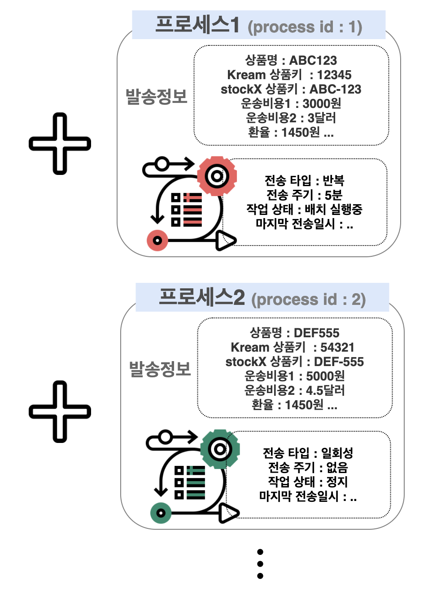

# 상품 VO(from api)

## \[1] 상품 VO(from api) 구조

* **api 호출을 통해 구성된 상품 VO이다.**
* **prodObj , prcInfo , apiResult 3가지 객체로 구성되어있다.**

<figure><figcaption>
 상품 VO(from api) 구조
</figcaption></figure>

### 1) **prodObj**

* api 호출을 통해 받아온 상품 기본 정보를 담는다.

### 2) prcInfo

* 각 사이즈 별 상품 상세 정보를 담는다.

### 3) **apiResult**

* api 호출 상태를 담는다.
